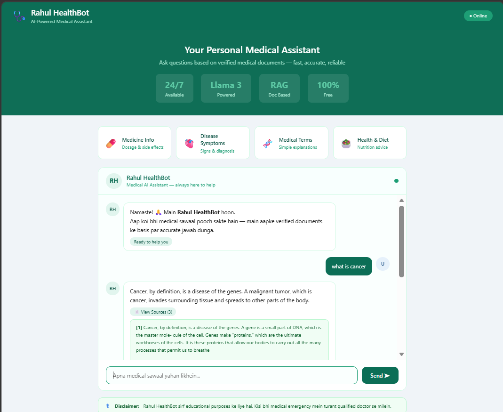
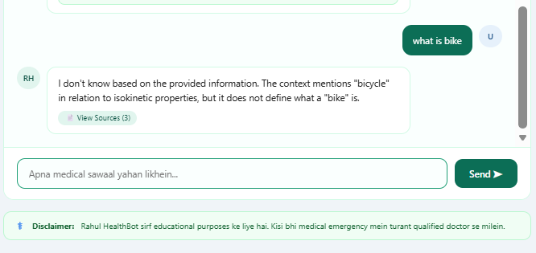

# 🩺 Rahul HealthBot

🚀 **Live Demo:** https://rahulbunker01-rahul-healthbot.hf.space

<p align="center">
  
  
</p>

> AI-Powered Medical Assistant — Verified Documents ke basis par accurate medical answers deta hai.


---

## 📌 Project Kya Hai?

Rahul HealthBot ek **RAG (Retrieval Augmented Generation)** based medical chatbot hai jo:
- Tumhari **Medical PDF** padh ke usse AI memory mein store karta hai
- User ke sawaal ka jawab **sirf PDF ke content** se deta hai
- **Groq + Llama 3** use karta hai — bilkul free aur fast

---

## 🔄 Poora Workflow

```
📄 Medical PDF
      ↓
create_memory.py
      ↓
┌─────────────────────────────────┐
│  1. PDF ke pages load karo      │
│  2. 500 words ke chunks banao   │
│  3. Chunks → Numbers (Embeddings)│
│  4. FAISS Vector Store mein save│
└─────────────────────────────────┘
      ↓
   FAISS DB (vectorstore/db_faiss/)
      ↓
User Browser pe sawaal karta hai
      ↓
main.py (FastAPI Server)
      ↓
connect_llm.py
      ↓
┌─────────────────────────────────┐
│  1. Sawaal → Numbers mein badlo │
│  2. FAISS se Top 3 chunks dhundo│
│  3. Chunks + Sawaal → Groq API  │
│  4. Llama 3 answer generate kare│
└─────────────────────────────────┘
      ↓
Browser pe Answer + Sources dikhao
```

---

## 📁 Project Structure

```
med/
├── 📁 data/                    ← Medical PDFs yahan rakho
│   └── medical_book.pdf
├── 📁 vectorstore/
│   └── db_faiss/               ← Auto-banta hai (mat chhedna)
│       ├── index.faiss
│       └── index.pkl
├── 📁 templates/
│   └── index.html              ← Frontend UI (Medical Theme)
├── 📁 venv/                    ← Virtual Environment
├── 📄 .env                     ← API Keys (secret)
├── 📄 create_memory.py         ← STEP 1: PDF → Vector Store
├── 📄 connect_llm.py           ← STEP 2: AI Brain (RAG Chain)
├── 📄 main.py                  ← STEP 3: FastAPI Web Server
└── 📄 requirements.txt         ← Libraries list
```

---

## ⚙️ Technologies Used

| Technology | Kaam |
|-----------|------|
| **FastAPI** | Web server — URLs handle karta hai |
| **Jinja2** | HTML template render karta hai |
| **LangChain** | AI pipeline banata hai |
| **FAISS** | Vector database — fast similarity search |
| **HuggingFace Embeddings** | Text → Numbers (all-MiniLM-L6-v2) |
| **Groq + Llama 3** | Free & fast LLM — answers generate karta hai |
| **sentence-transformers** | Embedding model |
| **PyPDF** | PDF pages load karta hai |

---

## 🚀 Setup — A to Z

### Step 1 — Project Folder Banao

```powershell
mkdir med
cd med
python -m venv venv
venv\Scripts\activate
```

### Step 2 — Libraries Install Karo

```powershell
venv\Scripts\python.exe -m pip install fastapi uvicorn jinja2 python-multipart python-dotenv langchain langchain-community langchain-core langchain-groq faiss-cpu sentence-transformers pypdf
```

### Step 3 — `.env` File Banao

```env
HF_TOKEN=hf_xxxxxxxxxxxxxxxxxxxxxxxx
GROQ_API_KEY=gsk_xxxxxxxxxxxxxxxxxxxxxxxx
```

> 🔑 **HF Token:** https://huggingface.co/settings/tokens
> 🔑 **Groq Token:** https://console.groq.com

### Step 4 — PDF `data/` Folder Mein Rakho

```
med/
└── data/
    └── your_medical_book.pdf   ← Yahan rakho
```

### Step 5 — Vector Store Banao (Sirf Ek Baar)

```powershell
venv\Scripts\python.exe create_memory.py
```

**Output aana chahiye:**
```
Total pages loaded: 45
Total chunks: 312
✅ Vectorstore saved at: vectorstore/db_faiss
```

### Step 6 — Server Chalao

```powershell
venv\Scripts\python.exe -m uvicorn main:app --port 8080
```

### Step 7 — Browser Mein Kholo

```
http://127.0.0.1:8080
```

---

## 📄 Files Ka Kaam

### `create_memory.py`
```
PDF load → Chunks banao → Embeddings banao → FAISS mein save karo
Sirf ek baar chalana hai ya nai PDF add karne par
```

### `connect_llm.py`
```
User question → FAISS se relevant chunks dhundo
→ Groq (Llama 3) ko bhejo → Answer wapas lo
```

### `main.py`
```
"/"    → index.html dikhao (UI)
"/ask" → connect_llm se answer lo, JSON mein bhejo
"/health" → Server status check karo
```

### `templates/index.html`
```
Medical theme wala frontend
User sawaal type kare → /ask pe POST → Answer dikhao
Typing animation + Source documents support
```

---

## ▶️ Hamesha Is Order Mein Chalao

```powershell
# 1️⃣ Sirf pehli baar ya nai PDF add karo tab
venv\Scripts\python.exe create_memory.py

# 2️⃣ Server chalao
venv\Scripts\python.exe -m uvicorn main:app --port 8080

# 3️⃣ Browser mein kholo
http://127.0.0.1:8080
```

---

## 🔧 Common Errors aur Fix

| Error | Reason | Fix |
|-------|--------|-----|
| `No module found` | venv activate nahi hua | `venv\Scripts\activate` chalao |
| `FAISS not found` | create_memory nahi chala | `python create_memory.py` chalao |
| `Port already in use` | Server pehle se chal raha | `--port 8081` use karo |
| `Groq 404 model not found` | Model decommissioned | `llama-3.3-70b-versatile` use karo |
| `unhashable type dict` | Jinja2 purana syntax | `request=request, name=` use karo |
| `GROQ_API_KEY not found` | .env load nahi hua | `load_dotenv()` check karo |

---

## 🧠 RAG Kya Hota Hai?

```
❌ Normal AI:                    ✅ RAG AI (Ye Project):

User: Cancer kya hai?           User: Cancer kya hai?
         ↓                               ↓
AI training data se             Tumhari PDF se
jawab deta hai                  relevant content dhundha
(outdated ho sakta hai)                  ↓
                                Llama 3 us content se
                                accurate answer deta hai
```

---

## 📦 Requirements.txt

```txt
fastapi
uvicorn
jinja2
python-multipart
python-dotenv
langchain
langchain-community
langchain-core
langchain-groq
faiss-cpu
sentence-transformers
pypdf
```

---

## 👨‍💻 Developer

**Rahul** — Medical AI Chatbot Project
- Model: `llama-3.3-70b-versatile` (Groq)
- Embeddings: `sentence-transformers/all-MiniLM-L6-v2`
- Vector DB: FAISS

---

> ⚕️ **Disclaimer:** Ye chatbot sirf educational purposes ke liye hai. Kisi bhi medical emergency mein turant qualified doctor se milein.
